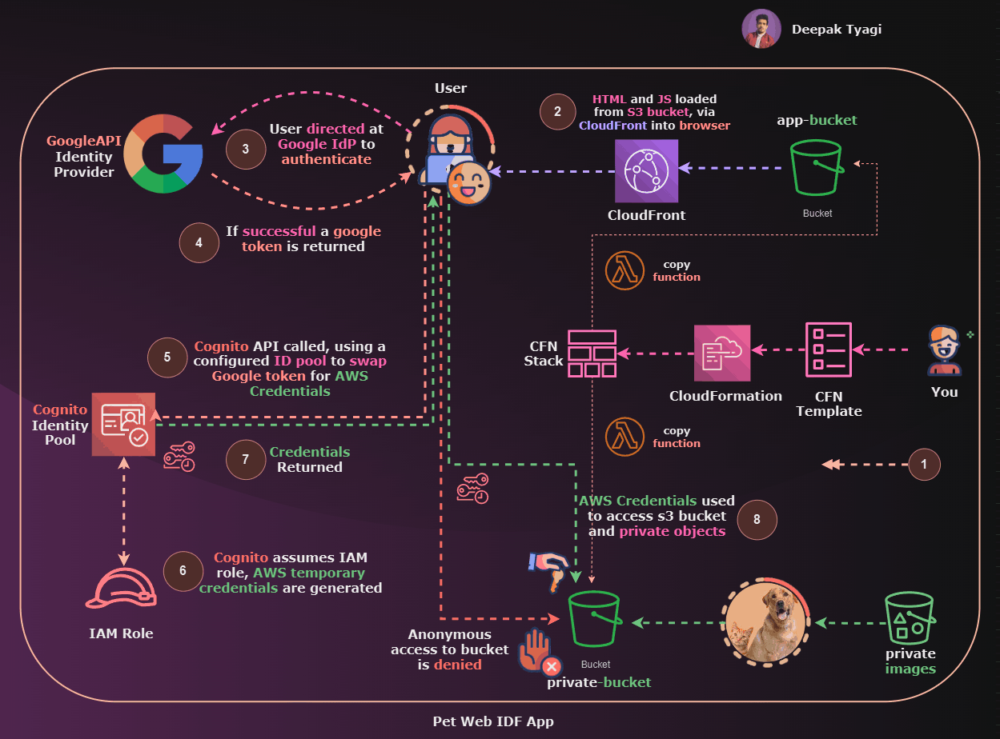

<h3 align="center">Connect with me:</h3>

 
  

    
	
   
    
  

# aws-cognito-pet-web-identity-federation

You will be implementing a simple serverless application which uses Web Identity Federation.
The application runs using the following technologies

- S3 for front-end application hosting
- Google API Project as an ID Provider
- Cognito and IAM Roles to swap Google Token for AWS credentials
- The application runs from a browser, gets the user to login using a Google ID and then loads all images from a private S3 bucket into a browser using presignedURLs.

This advanced demo consists of 6 stages :-

- STAGE 1 : Provision the environment and review tasks
- STAGE 2 : Create Google API Project & Client ID
- STAGE 3 : Create Cognito Identity Pool
- STAGE 4 : Update App Bucket & Test Application
- STAGE 5 : Cleanup the account

---

## Prerequisites

- **AWS Account** with administrative privileges.
- **Google Account** (Gmail) for setting up Google API credentials.

---

## Project Setup Guide

### STAGE 1: Set Up AWS Infrastructure

#### Step 1A: Login to AWS and Deploy Infrastructure
1. **Login** to your AWS account with administrative privileges.
2. Ensure your region is set to **us-east-1 (N. Virginia)**.
3. [**Click here**](https://us-east-1.console.aws.amazon.com/cloudformation/home?region=us-east-1#/stacks/quickcreate?templateURL=https://labs-content.s3.amazonaws.com/cloudformation-templates/pet-web-idf-template.yaml&stackName=PetWebIDF) to auto-configure the necessary AWS infrastructure for the app.
4. In the CloudFormation stack configuration, check the box for `The following resource(s) require capabilities: [AWS::IAM::ManagedPolicy, AWS::IAM::Role]`.
5. Click **Create Stack** and wait for the stack to reach `CREATE_COMPLETE` status.

#### Step 1B: Verify S3 `appbucket`
1. Open the [S3 Console](https://s3.console.aws.amazon.com/s3/home?region=us-east-1).
2. Open the bucket starting with **webidf-appbucket**.
3. Verify that it contains objects like **index.html** and **scripts.js**.
4. In the **Permissions** tab, ensure **Block all public access** is set to **Off**.
5. Verify a **bucket policy** exists for this bucket.

#### Step 1C: Verify S3 `privatebucket`
1. Locate the bucket starting with **webidf-patchesprivatebucket**.
2. Review the bucket’s contents to confirm they are as expected.
3. Confirm that this bucket does **not have a bucket policy** and is completely private.

#### Step 1D: Verify CloudFront Distribution
1. Open the [CloudFront Console](https://us-east-1.console.aws.amazon.com/cloudfront/v3/home?region=us-east-1#/distributions).
2. Find the distribution pointing to the **webidf-appbucket** as its origin.
3. Note the **distribution domain name** (e.g., `d1o4f0w1ew0exo.cloudfront.net`). This will be your **WebApp URL** with `https://` prefixed.

**Stage 1 Complete**: At this stage, your base infrastructure is ready with:
- Front-end app bucket
- Private patches bucket
- CloudFront distribution for caching and HTTPS

---

### STAGE 2: Configure Google API Project for OAuth 2.0

#### Step 2A: Create a Google API Project
1. Go to the [Google API Credentials Page](https://console.developers.google.com/apis/credentials).
2. **Sign in** or **create** a Google account if needed.
3. In the API Console, select your country, agree to terms, and click the **Select a project** dropdown.
4. Click **NEW PROJECT** and name it **PetIDF**.
5. Click **Create**.

#### Step 2B: Configure OAuth Consent Screen
1. In the Google API Console, go to **Credentials** > **CONFIGURE CONSENT SCREEN**.
2. Choose **External** and click **CREATE**.
3. Set the **App Name** to `PetIDF`, **User support email** to your own email, and **Developer contact information** to your email as well.
4. Click **SAVE AND CONTINUE** through each screen, then **BACK TO DASHBOARD**.

#### Step 2C: Create OAuth Client ID Credentials
1. Under **Credentials**, click **CREATE CREDENTIALS** > **OAuth client ID**.
2. Set **Application type** to **Web Application** and name it `PetIDFServerlessApp`.
3. Click **ADD URI** under **Authorized JavaScript origins**, then enter your **WebApp URL** (CloudFront distribution domain name) with `https://` prefixed.
4. Click **Create** and note down the **Client ID**. 

**Stage 2 Complete**: You now have a Google API Project with OAuth credentials configured.

---

### STAGE 3: Configure Amazon Cognito for User Authentication

#### Step 3A: Create a Cognito Identity Pool
1. Go to the [Cognito Console](https://console.aws.amazon.com/cognito/home?region=us-east-1#).
2. In the left menu, select **Federated Identities** and click **Create new identity pool**.
3. Name the pool **WebIDF**, expand **Authentication Providers**, and select **Google**.
4. Enter your **Google Client ID** from Stage 2.
5. Click **Create Pool** and note the **Identity Pool ID**.

#### Step 3B: Set Permissions
1. Cognito will create IAM role: for authenticated identities.

#### Step 3C: Adjust IAM Permissions for Private Bucket Access
1. Go to the [IAM Console](https://console.aws.amazon.com/iam/home?region=us-east-1#/home).
2. Under **Roles**, find and select the role named **Cognito_PetIDFIDPoolAuth_Role**.
3. Click **Trust Relationships** to review the conditions, which restrict access to authenticated users.
4. Click **Permissions** and then **Attach policies**.
5. Search for and attach the **PrivatePatchesPermissions** policy to allow access to the private bucket.

**Stage 3 Complete**: You have set up Cognito and configured IAM roles to control access to the private bucket.

---

### STAGE 4: Update and Test the Application

#### Step 4A: Download Required Files from S3
1. Open the **webidf-appbucket** in the [S3 Console](https://s3.console.aws.amazon.com/s3/home?region=us-east-1).
2. Download **index.html** and **scripts.js** to your local machine.

#### Step 4B: Update Files with Connection Information
1. Open `index.html` in a code editor, find `REPLACE_ME_GOOGLE_APP_CLIENT_ID`, and replace it with your **Google Client ID**.
2. Open `scripts.js`, replace `REPLACE_ME_COGNITO_IDENTITY_POOL_ID` with your **Identity Pool ID**.
3. Update `REPLACE_ME_NAME_OF_PATCHES_PRIVATE_BUCKET` with the name of **webidf-patchesprivatebucket**.
4. Save both files.

#### Step 4C: Upload Updated Files to S3
1. In the **webidf-appbucket** on the S3 Console, click **Upload**.
2. Add the updated `index.html` and `scripts.js`, then click **Upload**.

#### Step 4D: Test the Application
1. Open the **WebApp URL** (your CloudFront distribution URL).
2. Open your browser's developer console and click **Sign In** to authenticate.
3. After signing in, the console should show:
   - Google authentication
   - Cognito token exchange
   - S3 private bucket image display through presigned URLs.
4. Verify that three cat images load, indicating successful S3 access.

#### Handling Caching Issues
If issues arise with signing in, try invalidating the cache:
1. Go to the **CloudFront Console**, select your distribution, and navigate to **Invalidations**.
2. Click **Create invalidation**, enter `/index.html` and `/scripts.js`, and confirm.

**Stage 4 Complete**: You now have a fully functional serverless application that uses Google OAuth for authentication and AWS services for storage and identity management.
Certainly! Here is a blog and README section specifically for **Stage 5: Tearing Down the Serverless Application Resources**.

---

### Stage 5: Deleting Resources for the PetIDF Serverless Application

To safely remove all resources for the **PetIDF Serverless Application**, follow these steps:

1. **Delete Google API Project**:
   - Visit [Google Cloud Console](https://console.developers.google.com/cloud-resource-manager), locate **PetIDF**, and delete it.

2. **Delete Cognito Identity Pool**:
   - In the [AWS Cognito Console](https://console.aws.amazon.com/cognito/home?region=us-east-1), delete the **WebIDF** identity pool.

3. **Delete IAM Roles**:
   - In [IAM Console](https://console.aws.amazon.com/iam/home?region=us-east-1#/home), remove roles starting with **CognitoRole_PetIDF**.

4. **Delete CloudFormation Stack**:
   - In [CloudFormation Console](https://console.aws.amazon.com/cloudformation/home?region=us-east-1#/stacks), delete the **PetWebIDF** stack.

By completing these steps, all application resources will be fully deleted. 

These instructions should help you quickly remove your PetIDF application resources with confidence. Let me know if you'd like any more details!

---

### Final Project Summary
Congratulations! You've completed the setup of the **PetIDF Serverless Web Application**. Your application now includes:

- **S3 Bucket** for the front-end app
- **Google API Project** for OAuth authentication
- **Cognito Identity Pool** for user management
- **IAM Roles** for secure access to AWS resources
- **CloudFront Distribution** for secure and fast content delivery
